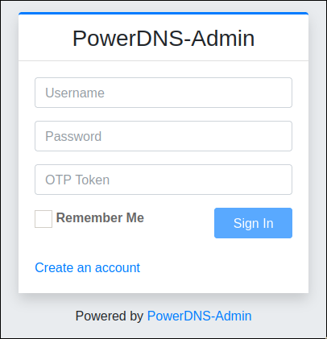
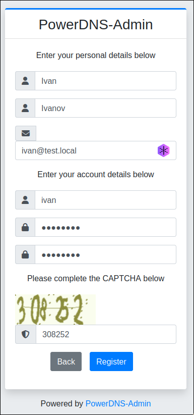
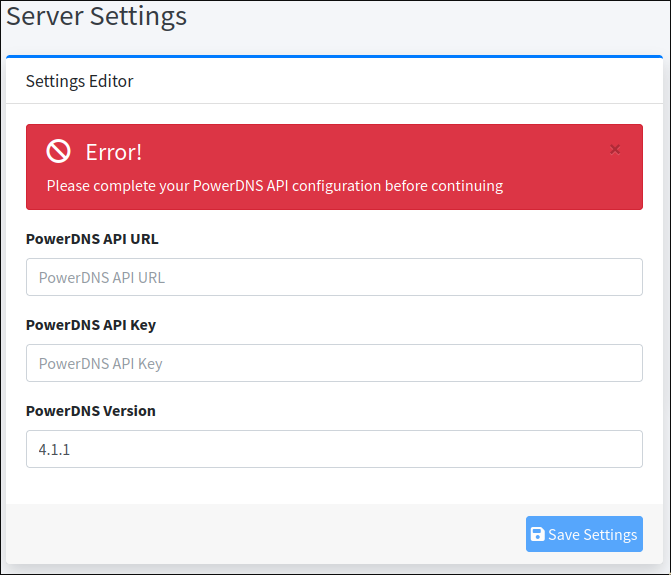
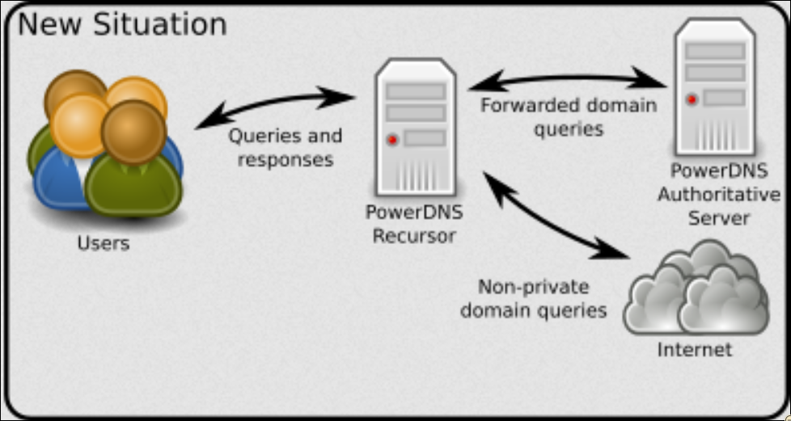

## PowerDNS Authoritative

### Installation

- Install `PowerDNS Authoritative` itself:
```bash
apt install pdns-server
```

- Also you need to install backend for PDNS(in this guide we will use `MariaDB`, so we need to install `mysql` backend):
```bash
apt install pdns-backend-mysql
```

- Install `MariaDB`:
```bash
apt install mariadb-server
```

### Configuration

- Run `mysql_secure_installation` to basically configure DBMS

- Run DBMS console:
```bash
mysql -u root -p
```

- Then create database for `PDNS`
```sql
CREATE DATABASE pdnsdb;
```

- Create user for `PDNS` and grant it permission for `pdnsdb`
```sql
CREATE USER 'pdnsuser'@'%' IDENTIFIED BY 'SuperSecretPDNSPassword';
GRANT ALL PRIVILEGES ON pdnsdb.* TO 'pdnsuser'@'%;
```

- Apply `PDNS` schema on database
```bash
mysql -u root -p pdnsdb < /usr/share/pdns-backend-mysql/schema/schema.mysql.sql
```

- Create backend config in `/etc/powerdns/pdns.d/gmysql.conf`
```ini
launch=gmysql
gmysql-host=localhost
gmysql-dbname=pdnsdb
gmysql-user=pdnsuser
gmysql-password=SuperSecretPDNSPassword
```

- (Optional) If you install `PDNS Admin`, you need to enable API on `PDNS Authoritative` and allow access from Docker container
(in `/etc/powerdns/pdns.conf`)
```ini
api=yes
api-key=XXXXXXX
webserver-address=(if API should be available from Docker use docker host ip, other cases leave 127.0.0.1)
webserver-allow-from=(if you use Docker, write docker net)
```
You can generate API key [here](https://codepen.io/corenominal/pen/rxOmMJ)

- (Optional) If you install `PDNS Recursor`, you need to configure `PDNS Authoritative` to use another port(eg. `54` instead of `53`)
(in `/etc/powerdns/pdns.conf`)
```ini
local-port=54
```

## PowerDNS Admin

### Installation
*We will install `PDNS Admin` using Docker because I couldn't install it without Docker*

- Create some directory and `docker-compose.yaml` file there
```yaml
version: '3.3'
services:
  core:
    image: powerdnsadmin/pda-legacy:latest
    restart: unless-stopped
    environment:
      - SECRET_KEY=VERYVERYVERYVERYSECRETKEY
	  - SQLALCHEMY_DATABASE_URI=mysql://pdnsuser:SuperSecretPDNSPassword@(host ip address)/pdnsdb
    ports:
      - "9191:80"
    volumes:
      - "core_data:/data"

volumes:
  core_data:
```
You can generate `SECRET_KEY` [here](https://stackoverflow.com/questions/34902378/where-do-i-get-secret-key-for-flask)

Replace `SQLALCHEMY_DATABASE_URI` with your credentials for DB


- Run docker-compose
```bash
docker compose up -d
```

### Initial configuration
Now proceed to web UI on `9191` port. You will see login form.



- Create account and log in with it



- Enter server settings



*PowerDNS API URL* - URL to `PDNS Authoritative` API, eg. `http://10.0.2.15:8081` (Note, URL should be available from container, you might use your machine address instead of `127.0.0.1`)

*PowerDNS API Key* - API key from `PDNS Authoritative` settings

*PowerDNS Version* - `PDNS Authoritative`'s version


## PowerDNS Recursor

### Installation

Install from repository
```bash
apt install pdns-recursor
```

### Configuration

We gonna use this topology:



So we need to bind `PDNS Authoritative` to port other than `53`(see `PDNS Authoritative` configuration)

Now we need to configure `Recursor` to forward `PDNS Authoritative`'s domains to `PDNS Authoritative`
```ini
forward-zones=(zone)=(Authoritative address)
forward-zones+=(zone #2)=(Authoritative address)
```

Also we need to bind `Recursor` to `0.0.0.0` so users can connect to it
```ini
local-address=0.0.0.0
```
